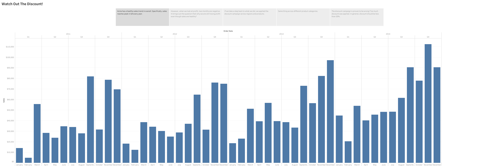
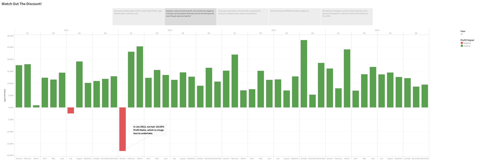
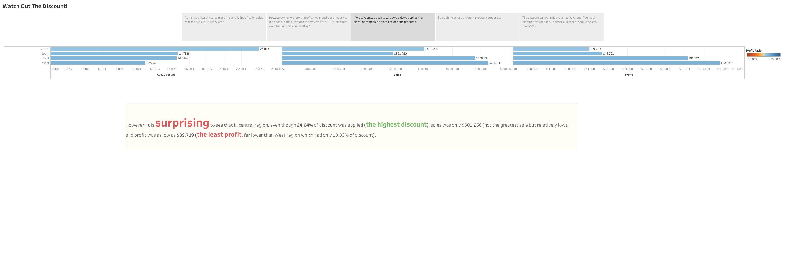
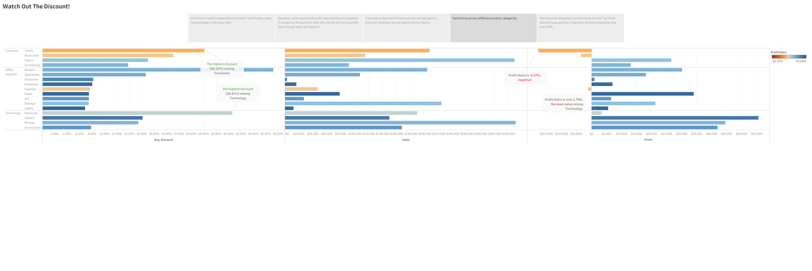
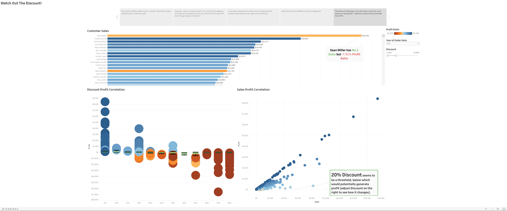

# Acme Superstore Discount Campaign Analysis

<figure></figure>

### Acme has a healthy sales trend in overall. Specifically, sales reaches peak in Q4 every year.
<figure></figure>

### However, when we look at profit, two months are negative. It brings out the question that why we are still losing profit even though sales are healthy? 
<figure></figure>

### If we take a step back to what we did, we applied the discount campaign across regions and products. 
<figure></figure>

### Same thing across different product categories.
<figure></figure>

### The discount campaign is proven to be wrong! Too much discount was applied. In general, discount should be less than 20%.
<figure></figure>

### Check out the full story [here](https://public.tableau.com/app/profile/ruichen.yang/viz/Superstore_16311596167870/WatchOutTheDiscount?publish=yes)